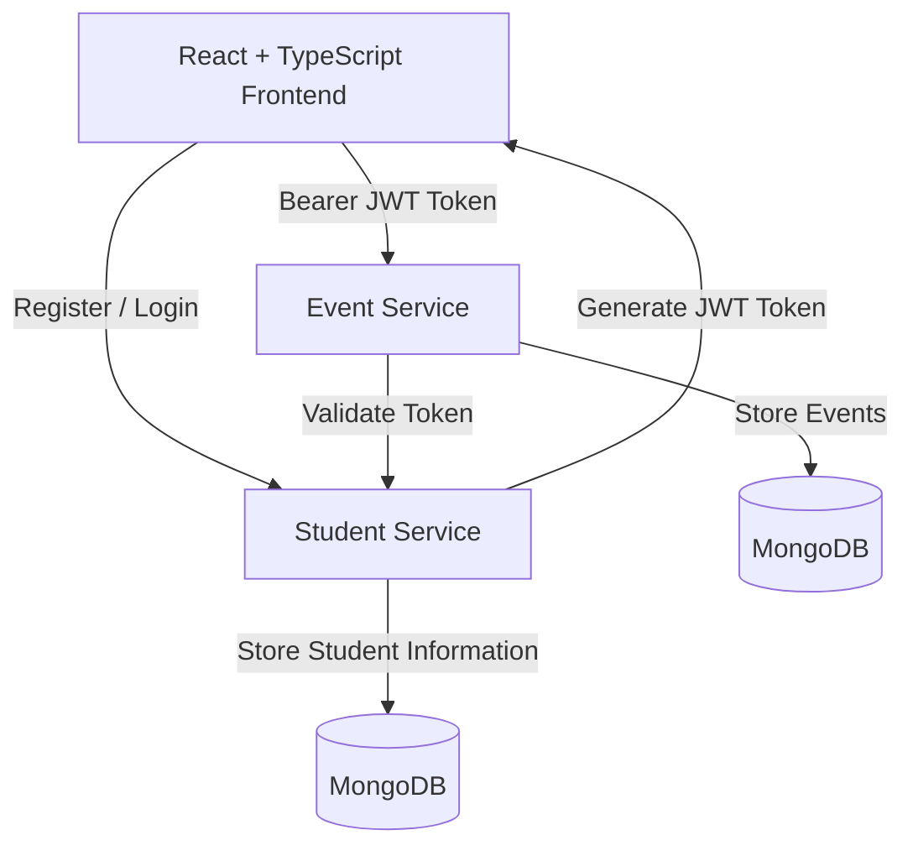
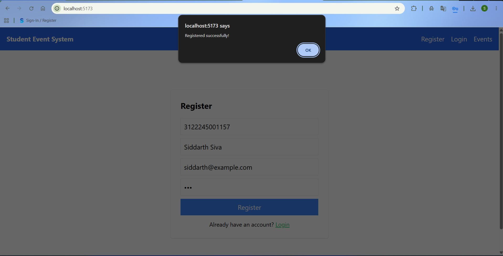
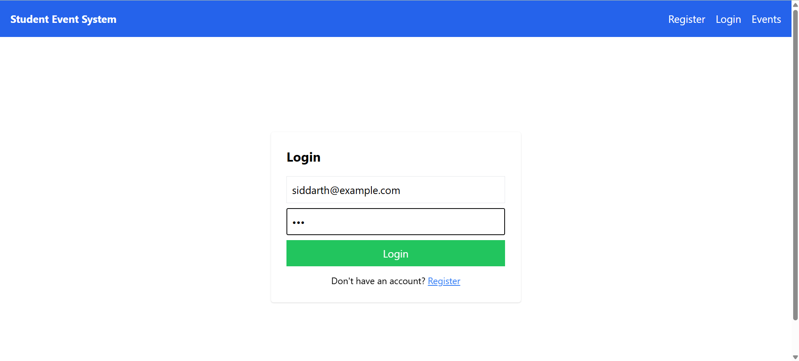
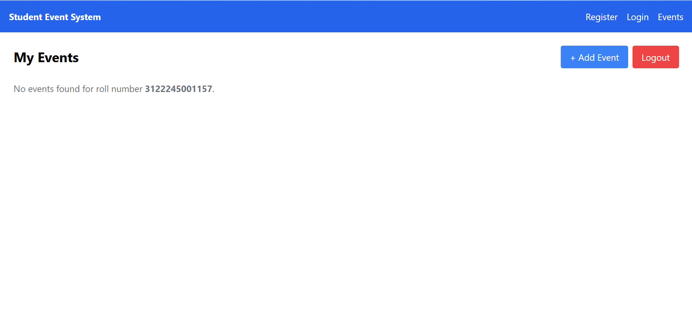
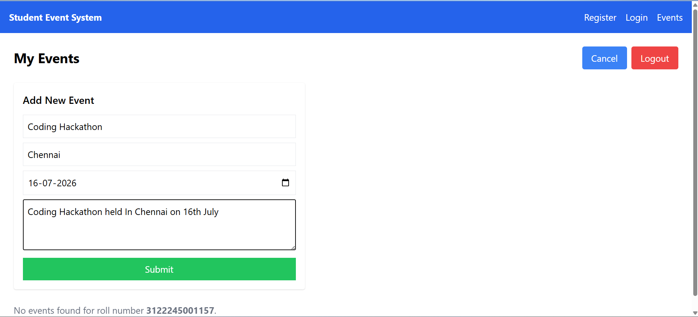
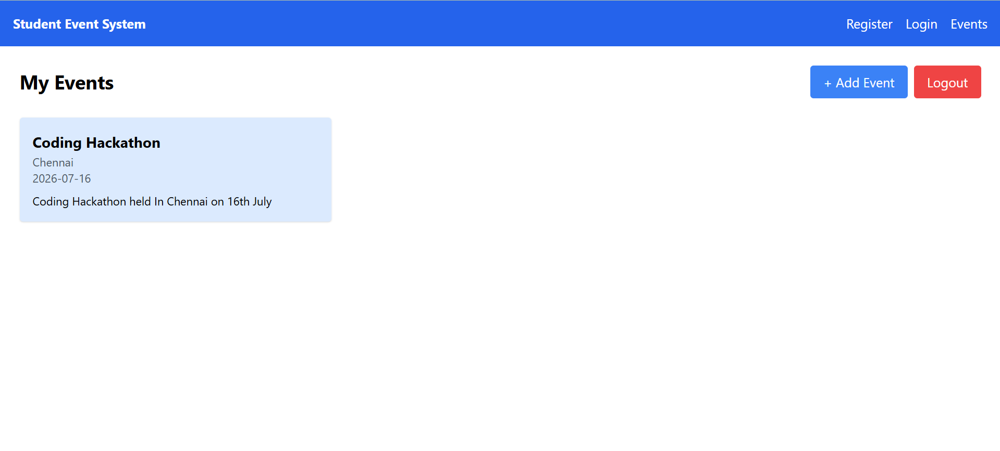
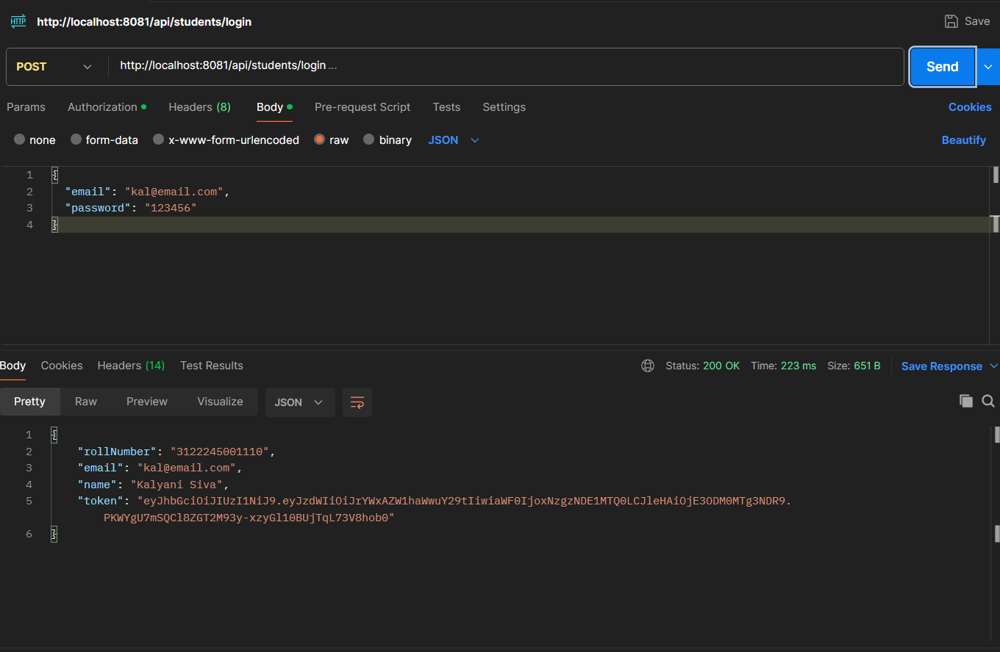
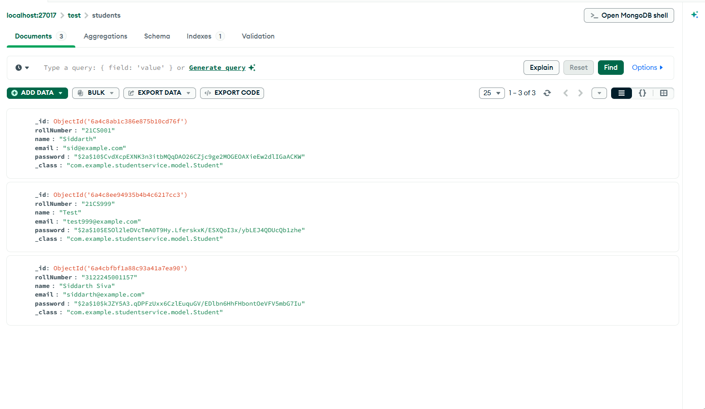
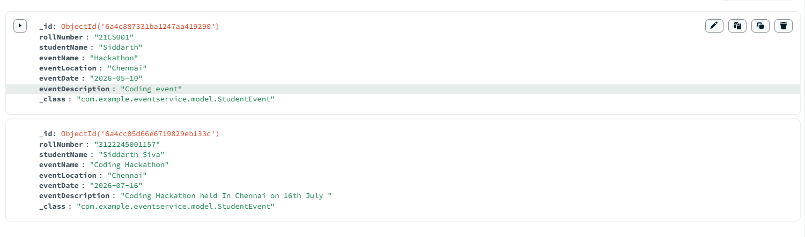

<div align="center">

# 🎓 Student Event Management System

### A Full-Stack Microservices Application for Student Event Management

Built using **Spring Boot**, **React**, **TypeScript**, **MongoDB**, and **JWT Authentication**


</div>

---

## 📖 Overview

The **Student Event Management System** is a full-stack web application that enables students to securely register, authenticate, and manage their personal events.

The backend follows a **microservices architecture**, separating student management and event management into independent Spring Boot services. Authentication is implemented using **JWT (JSON Web Tokens)**, while passwords are securely encrypted with **BCrypt** before being stored in **MongoDB**.

This project was built to gain hands-on experience with modern full-stack development, RESTful APIs, Spring Security, JWT authentication, React, and microservices.

---

## 🚀 Key Highlights

- 🏗️ **Microservices Architecture** with independent Student and Event services
- 🔐 **Secure JWT Authentication** powered by Spring Security
- 🔒 **BCrypt Password Hashing** for secure credential storage
- ⚛️ **React + TypeScript** frontend with a responsive user interface
- ☁️ **RESTful APIs** built using Spring Boot
- 🍃 **MongoDB** for efficient NoSQL data storage
- 🛡️ Protected API endpoints using **Bearer Token Authentication**
- 📮 API development and testing with **Postman**

---

## ✨ Features

### 👨‍🎓 Student Service
- Student registration
- Secure login using email & password
- JWT token generation
- BCrypt password encryption
- Duplicate email validation
- Duplicate roll number validation
- Fetch student details

### 📅 Event Service
- Add new events
- View events for the logged-in student
- JWT-protected APIs
- MongoDB data persistence

### 💻 Frontend
- Modern React + TypeScript UI
- Registration page
- Login page
- Event dashboard
- Add event form
- Secure logout
- Responsive design

---

## 🛠 Tech Stack

| Category | Technologies |
|---|---|
| **Frontend** | React, TypeScript, Vite, Tailwind CSS |
| **Backend** | Spring Boot, Spring Security, JWT, BCrypt |
| **Database** | MongoDB |
| **Build Tool** | Maven |
| **API Testing** | Postman |
| **Version Control** | Git, GitHub |

---

## 🏗️ System Architecture



---

## 📂 Project Structure

```text
StudentEventSystem/
├── student-backend/
│   ├── student-service/
│   └── event-service/
├── student-frontend/
├── screenshots/
└── README.md
```

---

## 🚀 Getting Started

### Prerequisites

Before running the project, ensure the following are installed:

- Java 17+
- Maven
- Node.js
- MongoDB
- Git

### Clone the Repository

```bash
git clone https://github.com/siddarthsiva06/StudentEventSystem.git
cd StudentEventSystem
```

### Start MongoDB

Make sure MongoDB is running locally.

Default connection:
```text
mongodb://localhost:27017
```

### Run Student Service

```bash
cd student-backend/student-service
mvn spring-boot:run
```

Runs on: `http://localhost:8081`

### Run Event Service

Open another terminal:

```bash
cd student-backend/event-service
mvn spring-boot:run
```

Runs on: `http://localhost:8082`

### Run Frontend

Open another terminal:

```bash
cd student-frontend
npm install
npm run dev
```

Runs on: `http://localhost:5173`

---

## 🔐 Authentication

1. Student registers using Roll Number, Name, Email and Password.
2. Password is encrypted using BCrypt before storage.
3. Student logs in with Email and Password.
4. Student Service generates a JWT token.
5. Frontend stores the JWT in Local Storage.
6. Protected requests include:

Authorization: Bearer <JWT_TOKEN>

7. Event Service validates the JWT before processing requests.

---

## 📡 REST API

### Student Service

| Method | Endpoint | Description |
|:---:|---|---|
| `POST` | `/api/students/register` | Register student |
| `POST` | `/api/students/login` | Login student |
| `GET` | `/api/students/roll/{rollNumber}` | Get student details |

### Event Service

| Method | Endpoint | Description |
|:---:|---|---|
| `POST` | `/api/events/add` | Add event |
| `GET` | `/api/events/student/{rollNumber}` | View student events |

---

## 🔒 Security Features

- JWT authentication
- Spring Security
- BCrypt password encryption
- Protected REST APIs
- Duplicate email validation
- Duplicate roll number validation
- CORS configuration

---

## 📸 Application Screenshots

| Screen | Preview |
|---|---|
| Registration |  |
| Login |  |
| Student Dashboard |  |
| Add Event |  |
| Display Events |  |
| JWT Authentication |  |
| Student Collection (MongoDB) |  |
| Event Collection (MongoDB) |  |

---

## 🎯 Learning Outcomes

This project provided hands-on experience with:

- Building RESTful APIs using Spring Boot
- Implementing JWT authentication & Spring Security
- Password encryption using BCrypt
- Developing a microservices architecture
- Integrating React with Spring Boot
- Managing MongoDB databases
- API testing using Postman
- Git & GitHub version control

---

## 🚀 Future Enhancements

- Edit existing events
- Delete events
- Event search & filtering
- Pagination
- Admin dashboard
- Email notifications
- Docker containerization
- Cloud deployment (AWS / Render)

---

## 👨‍💻 Author

**Siddarth Subramaniam Siva**
B.E. Computer Science Engineering, SSN College of Engineering
GitHub: [@siddarthsiva06](https://github.com/siddarthsiva06)

---

## ⭐ Support

If you found this project helpful, consider giving it a **⭐ star** on GitHub — it motivates me to continue building and sharing more projects!

---

## 📜 License

This project is developed for educational and learning purposes.